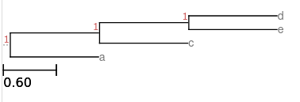
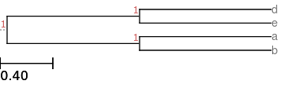
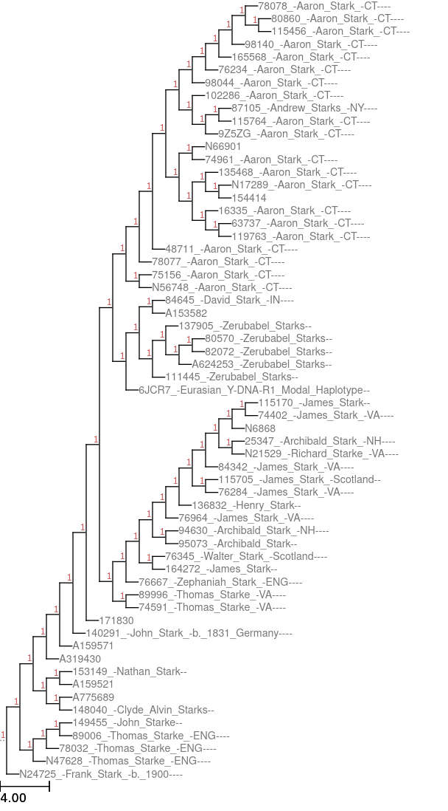

# Homework 1 - CSE 320 - Fall 2023
#### Professor Eugene Stark

### **Due Date: Friday 09/22/2023 @ 11:59pm**

**Read the entire doc before you start**

## Introduction

In this assignment, you will implement a command-line program
(called `philo`) whose purpose is to construct a phylogenetic tree from
genetic distance data given as input.
The goal of this homework is to familiarize yourself with C programming,
with a focus on input/output, bitwise manipulations, and the use of pointers.

For all assignments in this course, you **MUST NOT** put any of the functions
that you write into the `main.c` file.  The file `main.c` **MUST ONLY** contain
`#include`s, local `#define`s and the `main` function (you may of course modify
the `main` function body).  The reason for this restriction has to do with our
use of the Criterion library to unit test your code.
Beyond this, you may have as many or as few additional `.c` files in the `src`
directory as you wish.  Also, you may declare as many or as few headers as you wish.
Note, however, that header and `.c` files distributed with the assignment base code
often contain a comment at the beginning which states that they are not to be
modified.  **PLEASE** take note of these comments and do not modify any such files,
as they will be replaced by the original versions during grading.

> :scream: Array indexing (**'A[]'**) is not allowed in this assignment.
> You **MUST USE** pointer arithmetic instead.
> **No** array brackets (**'[', ']'**) are allowed.
> This means you cannot declare your own arrays.
> All necessary arrays are declared in the `global.h` header file.
> You **MUST USE** these arrays. **DO NOT** create your own arrays.
> We **WILL** check for this.

> :nerd: Reference for pointers: [https://beej.us/guide/bgc/html/#pointers](https://beej.us/guide/bgc/html/#pointers).

# Getting Started

Fetch base code for `hw1` as described in `hw0`. You can find it at this link:
[https://gitlab02.cs.stonybrook.edu/cse320/hw1](https://gitlab02.cs.stonybrook.edu/cse320/hw1).
**IMPORTANT: 'FETCH AND MERGE', DO NOT 'CLONE'.**

Both repos will probably have a file named `.gitlab-ci.yml` with different contents.
Simply merging these files will cause a merge conflict. To avoid this, we will
merge the repos using a flag so that the `.gitlab-ci.yml` found in the `hw1`
repo will replace the `hw0` version.  To merge, use this command:

```
git merge -m "Merging HW1_CODE" HW1_CODE/master --strategy-option=theirs
```

> :scream: Based on past experience, many students will either ignore the above command or forget
> to use it.  The result will be a **merge conflict**, which will be reported by git.
> Once a merge conflict has been reported, it is essential to correct it before committing
> (or to abort the merge without committing -- use `git merge --abort` and go back and try again),
> because git will have inserted markers into the files involved indicating the locations of the
> conflicts, and if you ignore this and commit anyway, you will end up with corrupted files.
> You should consider it important to read up at an early stage on merge conflicts with git and
> how to resolve them properly.

Here is the structure of the base code:

<pre>
.
├── .gitlab-ci.yml
└── hw1
    ├── .gitignore
    ├── hw1.sublime-project
    ├── include
    │   ├── debug.h
    │   └── global.h
    ├── Makefile
    ├── rsrc
    │   ├── harrison1.csv
    │   ├── harrison2.csv
    │   ├── saitou_nei.csv
    │   ├── stark_familytree_dna.csv
    │   ├── wikipedia.csv
    │   └── wikipedia_edges.out
    ├── src
    │   ├── main.c
    │   ├── philo.c
    │   └── validargs.c
    ├── test_output
    │   └── .git-keep
    └── tests
        └── basecode_tests.c
</pre>

- The `.gitlab-ci.yml` file is a file that specifies "continuous integration" testing
to be performed by the GitLab server each time you push a commit.  Usually it will
be configured to check that your code builds and runs, and that any provided unit tests
are passed.  You are free to change this file if you like.

> :scream:  The CI testing is for your own information; it does not directly have
> anything to do with assignment grading or whether your commit has been properly
> pushed to the server.  If some part of the testing fails, you will see the somewhat
> misleading message "commit failed" on the GitLab web interface.
> This does **not** mean that "your attempt to commit has failed" or that "your commit
> didn't get pushed to the server"; the very fact that the testing was triggered at
> all means that you successfully pushed a commit.  Rather, it means that "the CI tests
> performed on a commit that you pushed did not succeed".  The purpose of the tests are
> to alert you to possible problems with your code; if you see that testing has failed
> it is worth investigating why that has happened.  However, the tests can sometimes
> fail for reasons that are not your fault; for example, the entire CI "runner" system
> may fail if someone submits code that fills up the system disk.  You should definitely
> try to understand why the tests have failed if they do, but it is not necessary to be
> overly obsessive about them.

- The `hw1.sublime-project` file is a "project file" for use by the Sublime Text editor.
It is included to try to help Sublime understand the organization of the project so that
it can properly identify errors as you edit your code.

- The `Makefile` is a configuration file for the `make` build utility, which is what
you should use to compile your code.  In brief, `make` or `make all` will compile
anything that needs to be, `make debug` does the same except that it compiles the code
with options suitable for debugging, and `make clean` removes files that resulted from
a previous compilation.  These "targets" can be combined; for example, you would use
`make clean debug` to ensure a complete clean and rebuild of everything for debugging.

- The `include` directory contains C header files (with extension `.h`) that are used
by the code.  Note that these files often contain `DO NOT MODIFY` instructions at the beginning.
You should observe these notices carefully where they appear.

- The `src` directory contains C source files (with extension `.c`).

- The `tests` directory contains C source code (and sometimes headers and other files)
that are used by the Criterion tests.

- The `rsrc` directory contains some samples of data files that you can use for
testing purposes.

 - The `test_output` directory is a scratch directory where the Criterion tests can
put output files.  You should not commit any files in this directory to your
`git` repository.

## A Note about Program Output

What a program does and does not print is VERY important.
In the UNIX world stringing together programs with piping and scripting is
commonplace. Although combining programs in this way is extremely powerful, it
means that each program must not print extraneous output. For example, you would
expect `ls` to output a list of files in a directory and nothing else.
Similarly, your program must follow the specifications for normal operation.
One part of our grading of this assignment will be to check whether your program
produces EXACTLY the specified output.  If your program produces output that deviates
from the specifications, even in a minor way, or if it produces extraneous output
that was not part of the specifications, it will adversely impact your grade
in a significant way, so pay close attention.

> :scream: Use the debug macro `debug` (described in the 320 reference document in the
> Piazza resources section) for any other program output or messages you many need
> while coding (e.g. debugging output).

# Part 1: Program Operation and Argument Validation

In this part of the assignment, you will write a function to validate the arguments
passed to your program via the command line. Your program will treat arguments
as follows:

- If the `-h` flag is provided, you will display the usage for the program and
  exit with an `EXIT_SUCCESS` return code.

- If the `-h` flag is not provided, then the program will proceed to read genetic
distance data from standard input (`stdin`), construct a phylogenetic tree based
on this data, and produce some output related to this tree on standard output
(`stdout`).  If the program is successful, it will exit with an `EXIT_SUCCESS`
return code, otherwise the program will exit with an `EXIT_FAILURE` return code.
In the latter case, the program will print to standard error (`stderr`) an error
message or messages describing the error(s) that were discovered.

- If no arguments are provided, then the default behavior of the program is to
output edge data for the synthesized tree on `stdout`.

- If the `-m` (matrix) flag is provided, then instead of the edge data, the
program will output to `stdout` the matrix of estimated node distances constructed
during the run.

- If the `-n` (newick) flag is provided, then instead of the edge data, the
program will output to `stdout` a representation, in "Newick" format, of the
phylogenetic tree synthesized from the input data.  As discussed below, the
production of this output requires that an "outlier" node be selected in order
to orient the edges of the tree.  The `-o` option provides the user to specify
the name of a leaf node to serve as the outlier.  If this option is not provided,
then the program uses a default strategy to choose an outlier.

Note that the program reads input data from `stdin` and writes results to `stdout`.
Error messages are issued to `stderr`.  No other output is produced.  If the program
runs without error, then it will exit with the `EXIT_SUCCESS` status code;
if any error occurs during the execution of the program, then it will exit with the
`EXIT_FAILURE` status code.

> :nerd: `EXIT_SUCCESS` and `EXIT_FAILURE` are macros defined in `<stdlib.h>` which
> represent success and failure return codes respectively.

> :nerd: `stdin`, `stdout`, and `stderr` are special I/O "streams", defined
> in `<stdio.h>`, which are automatically opened at the start of execution
> for all programs, do not need to be reopened, and (almost always) should not
> be closed.  In lieu of closing `stdout` or `stderr`, in certain circumstances
> (such as at the end of execution) it might be necessary to `fflush()` these
> output streams.

> :nerd: For accessing an input stream (such as `stdin`) you should use the `fgetc()`
> function, which reads a single byte of data from a stream.  When parsing
> input read from a stream, there are some situations in which it is convenient
> to take a byte of data that has already been read and "push it back" into the
> input stream.  The `ungetc()` function should be used for this.  Do not attempt
> to use `ungetc()` to "push back" more than one character.  The `fgetc()` and
> `ungetc()` functions are the **only** functions that you should use for reading input.
> For writing to an output stream, you may use `fputc()` and `fprintf()`.

> :scream: Any libraries that help you parse strings (`string.h`, `ctype.h`, etc.)
> are **prohibited** for this assignment.  The use of `atoi`, `scanf`, `fscanf`, `sscanf`,
> and similar functions is likewise prohibited.  *This is intentional and
> will help you practice parsing strings and manipulating pointers.*

The usage scenarios for this program are described by the following message,
which is printed by the program when it is invoked with the `-h` argument:

```
USAGE: bin/philo [-h] [-m|-n] [-o <name>]
   -h         Help: displays this help menu.
   -m         Output matrix of estimated distances, instead of edge data.
   -n         Output tree in Newick format, instead of edge data.
   -o <name>  Use <name> as the name of the outlier node to use for Newick output
              (only permitted if -n has already appeared).
```

If -h is specified, then it must be the first option on the command line, and any
other options are ignored.

If -h is not specified, then the program reads distance data from the standard input,
and synthesizes an unrooted tree using the neighbor joining method.  The default
behavior of the program is to output the edges in the synthesized tree to the standard output.

If -m is specified, then the final matrix of estimated node distances is output to
to the standard output, instead of the edge data.

If -n is specified, then a representation of the synthesized tree in Newick format is output
to the standard output, instead of the edge data.  The -o option, which is only permitted
after -n, is used to specify the name of an 'outlier' node to be used in constructing a rooted
tree for Newick output.
</pre>

The square brackets in the above message indicate that the enclosed argument is optional.
The '-m|-n' indicates that one or the other of '-m' or '-n' (but not both) may be used.
A valid invocation of the program implies that the following hold about
the command-line arguments:

- If the `-h` flag is provided, it is the first argument after
the program name and any other arguments that follow are ignored.

- The optional flags may come in any order.  The `-o` flag may only appear if `-n`
has previously been specified.  If `-o` occurs, it must be followed by a single
`<name>` argument.

For example, the following are a subset of the possible valid argument combinations:

- `$ bin/philo -h ...`
- `$ bin/philo`
- `$ bin/philo -m`
- `$ bin/philo -n -o Adam`

> :scream: The `...` means that all arguments, if any, are to be ignored; e.g.
> the usage `bin/philo -h -x -y BLAHBLAHBLAH -z` is equivalent to `bin/philo -h`.

Some examples of invalid combinations would be:

- `$ bin/philo -x`
- `$ bin/philo foo`
- `$ bin/philo -m -o Adam`
- `$ bin/philo -n -o`

> :scream: You may use only "raw" `argc` and `argv` for argument parsing and
> validation. Using any libraries that parse command line arguments (e.g.
> `getopt.h`) is prohibited.

> :scream: You **MAY NOT** use dynamic memory allocation in this assignment
> (i.e. `malloc`, `realloc`, `calloc`, `mmap`, etc.).  You have been provided
> with pre-declared arrays which you should use as storage for the purposes
> discussed further below.

> :nerd: Reference for command line arguments: [https://beej.us/guide/bgc/html/#command-line-arguments](https://beej.us/guide/bgc/html/#command-line-arguments).

**NOTE:** The `make` command compiles the `philo` executable into the `bin` folder.
All commands from here on are assumed to be run from the `hw1` directory.

### **Required** Validate Arguments Function

In `global.h`, you will find the following function prototype (function
declaration) already declared for you. You **MUST** implement this function
as part of the assignment.

```c
int validargs(int argc, char **argv);
```

The file `validargs.c` contains the following specification of the required behavior
of this function:

```c
/**
 * @brief Validates command line arguments passed to the program.
 * @details This function will validate all the arguments passed to the
 * program, returning 0 if validation succeeds and -1 if validation fails.
 * Upon successful return, the various options that were specified will be
 * encoded in the global variable 'global_options', where it will be
 * accessible elsewhere in the program.  For details of the required
 * encoding, see the assignment handout.
 *
 * @param argc The number of arguments passed to the program from the CLI.
 * @param argv The argument strings passed to the program from the CLI.
 * @return 0 if validation succeeds and -1 if validation fails.
 * @modifies global variable "global_options" to contain an encoded representation
 * of the selected program options.
 */
```

> :scream: This function must be implemented as specified as it will be tested
> and graded independently. **It should always return -- the USAGE macro should
> never be called from validargs.**

The `validargs` function should return -1 if there is any form of failure.
This includes, but is not limited to:

- Invalid number of arguments (too few or too many).

- Invalid ordering of arguments.

- A missing outlier name where one is required.

The `global_options` variable of type `long` is used to record the mode
of operation (i.e. encode/decode) of the program and associated parameters.
This is done as follows:

- If the `-h` flag is specified, the least significant bit (bit 0) is 1.

- If the `-n` flag is specified, the second-least significant bit (bit 1)
  is 1.

- If the `-m` flag is specified, the third-least significant bit (bit 2)
  is 1.

- If the `-o` flag is specified, the global variable `outlier_name` is
set to point to the outlier name that appears immediately after the `-o`
flag.

If `validargs` returns -1 indicating failure, your program must call
`USAGE(program_name, return_code)` and return `EXIT_FAILURE`.
**Once again, `validargs` must always return, and therefore it must not
call the `USAGE(program_name, return_code)` macro itself.
That should be done in `main`.**

If `validargs` sets the least-significant bit of `global_options` to 1
(i.e. the `-h` flag was passed), your program must call `USAGE(program_name, return_code)`
and return `EXIT_SUCCESS`.

> :nerd: The `USAGE(program_name, return_code)` macro is already defined for you
> in `global.h`.

If validargs returns 0, then your program must read input data from `stdin`
and (depending on the options supplied) write output data to `stdout` and tracing/error
information to `stderr`.
Upon successful completion, your program should exit with exit status `EXIT_SUCCESS`;
otherwise, in case of an error it should exit with exit status `EXIT_FAILURE`.

Unless the program has been compiled for debugging (using `make debug`),
in a successful run that exits with `EXIT_SUCCESS` no unspecified output may be produced
by the program.  In an unsuccessful run in which the program exits with `EXIT_FAILURE`
the program should output to `stderr` an error message or messages that indicate
the reason for the failure.

> :nerd: Remember `EXIT_SUCCESS` and `EXIT_FAILURE` are defined in `<stdlib.h>`.
> Also note, `EXIT_SUCCESS` is 0 and `EXIT_FAILURE` is 1.

### Example validargs Executions

The following are examples of the setting of `global_options` and the
other global variables for various command-line inputs.
Each input is a bash command that can be used to invoke the program.

- **Input:** `bin/philo -h`.  **Setting:** `global_options=0x1`
(`help` bit is set, other bits clear).

- **Input:** `bin/philo -m`.  **Setting:** `global_options=0x4`.

- **Input:** `bin/philo -n -o foo`.  **Setting:** `global_options=0x2`.
In addition, `outlier_name` should point to `"foo"`.

- **Input:** `bin/filo -m -o`.  **Setting:** `global_options=0x0`.
This is an error case because an incorrect combination of arguments
has been given.
In this case `validargs` returns -1, leaving `global_options` unset.

### Overview of Program Operation

Once the command-line arguments have been processed by `validargs`,
the basic operation of the program is to read genetic distance data from
standard input (`stdin`), construct a phylogenetic tree from the
given input data, and write information about the synthesized
tree to standard output (`stdout`).  You should use the library function
`fgetc()` to read data a character at a time from `stdin` and
you should use `fputc()` to write data a character at a time to `stdout`.
While parsing the input data, it will be helpful to be able to
"push back" onto the input stream a character that has already been read.
You may use `ungetc()` for this.  However, you should not attempt to
push back more than one character at a time.

The format of the input and output, as well as the algorithm to be used
to construct the tree, are discussed in more detail in the next section.

# Part 2: Constructing Phylogenetic Trees from Distance Data

In Biology, a phylogenetic tree is a tree that shows the evolutionary
relationships between groups of related organisms
(see, *e.g.* [Wikipedia (Phylogenetic tree)](https://en.wikipedia.org/wiki/Phylogenetic_tree).
The groups of organisms are called "taxonomic units" or "taxa"
(singular, "taxon").
Such trees are also used to represent ancestral relationships in
genetic genealogy
(see, *e.g.* [Wikipedia (Genetic genealogy)](https://en.wikipedia.org/wiki/Genetic_genealogy)).
Various kinds of phylogenetic trees are used in different situations and
for different purposes.  Here we will be concerned primarily with
*unrooted*, *bifurcating* (or binary) trees.

A typical problem that the biologist or genetic genealogist wants to solve
involves the reconstruction of a phylogenetic tree from genetic data,
obtained, for example, by DNA analysis.  For example, DNA sequencing
techniques may be used to obtain full or partial DNA sequences for the
organisms of interest, and then the goal is to try to construct a tree that
best represents the evolutionary process that led to the divergence of
these organisms from a common ancestor.  Or, in genetic genealogy, instead
of full DNA sequences, information about the variation of these sequences
at selected "marker" sites may be used.  For example, in the Y-chromosome
DNA analysis performed by the consumer-oriented commercial service
[Family Tree DNA](https://www.familytreedna.com) information may be collected
about short repeating sequences ("short tandem repeats" or "STRs")
at several hundred sites in the Y-chromosome DNA sequence.
In reconstructing a tree from genetic data, one would like to obtain a tree
that is a "good" explanation of how the similarities and differences between
the various organisms arose, and perhaps even have some assurance that the tree
one obtains is likely to be a faithful representation of the true historical
evolutionary tree.
Algorithms for reconstructing trees therefore try to ensure that organisms
with very similar genetic data occur close to each other in the tree,
and organisms with very different genetic data occur farther away from
each other.

For this assignment, we will focus on one particular kind of genetic data
and one particular tree reconstruction algorithm, which is called the "neighbor joining"
method.  Although the research literature provides some justification for this
method in terms of maximum likelihood estimation theory, we will not worry
about that and will just implement the algorithm.
We will assume that the genetic data used by the algorithm is given in the
form of "genetic distance" matrices, which provide, for each pair of taxa,
a number that tells "how far apart" the genetic data are for these
particular taxa.  Many kinds of genetic data can be reduced to such genetic
distance matrices; for example, we could regard the distance between two
DNA sequences as being the number of positions at which the sequences
disagree.  Or, for STR data, we can regard the genetic data for each taxon
as a vector that provides a numeric value (number of sequence repeats)
for each of the marker positions, and we could regard the distance between
two such vectors as the sum of the absolute value of the differences
between the corresponding entries in the vectors.
A genetic distance matrix D obtained in this way has the property of being
*symmetric* (D(i, j) = D(j, i) for all i, j) and having zeroes on the
main diagonal (D(i, i) = 0 for all i).
The neighbor joining method starts with such matrix and iteratively builds
a tree by repeatedly finding two taxa that are "close" to each other as
determined by D, and making those two taxa the children of a common parent
node.  Each iteration decreases the number of nodes under consideration by
one, and the algorithm continues until there are just two nodes left,
at which point these two nodes are made to be neighbors of each other,
resulting in an unrooted binary tree that connects all the nodes.
The originally given taxa occur as the leaf nodes in this tree, and the
nodes created during the algorithm are the internal nodes.
For tutorial descriptions of how the neighbor joining works on some small
examples, you should refer to
[Wikipedia (Neighbor joining)](https://en.wikipedia.org/wiki/Neighbor_joining) or
[Harrison/UDel (Neighbor joining trees)](https://www.tenderisthebyte.com/blog/2022/08/31/neighbor-joining-trees/).
I will just describe below the calculations that are performed at each
stage of the algorithm and try to clarify some things that I found confusing.
If you like, you may also refer to
[Saitou+Nei](https://academic.oup.com/mbe/article/4/4/406/1029664)
(the original paper that presented this method), though that is not necessary
for the "cookbook" approach we are taking here.

Initially, the algorithm is given a (square) symmetric distance matrix D,
as described above.  The row and column indices of the initial matrix
correspond to the taxa that will become the leaves of the tree.
We will assume the set of taxa to be non-empty, so that the matrix D
actually has something in it.
The case in which there is just one taxon is an edge case, in which
the matrix D contains only the single entry D(0, 0) = 0 and there is only
one possible tree that can be produced; namely the tree with a single
leaf node corresponding to the given taxon.
The "main loop" of the algorithm runs when there are three or more nodes
remaining.  In the main loop, two nodes will be chosen and made the child
of a newly created parent node.  The distance matrix will be updated to
include distances betwen the newly created node and the other nodes,
and then the two child nodes will be removed from consideration, leaving
a set of nodes whose size is one smaller than it was at the beginning of
the iteration.  This procedure repeats until there are only two nodes
remaining to be considered.  At that point, the two nodes are set to be
neighbors (without introducing any new node) and the algorithm terminates.
The output of the algorithm consists of the edges between nodes that
were created during the algorithm, together with a full distance matrix
that extends the originally given matrix D by giving distance estimates
for all the additional nodes created during the execution of the algorithm.
The edges created during the algorithm connect the nodes into a unrooted
binary tree in which the original taxa occur as the leaf nodes and
the nodes created during the algorithm occur as the internal nodes.
Each leaf node will be adjacent to exactly one internal node in this tree
and each internal node will be adjacent to exactly three other nodes
(either three internal nodes or one internal node and two leaf nodes).
For information on unrooted binary trees, refer to
[Wikipedia (Unrooted binary tree)](https://en.wikipedia.org/wiki/Unrooted_binary_tree).

The core details of the algorithm concern the method for selecting the
two nodes to be made "neighbors" (children of a new parent) at each
iteration.  This is done according to the following procedure:

0. Let the initial number of "active" nodes remaining to be considered be `N`.

1. A vector `S(i)` is created whose `N` entries correspond to the sums of
   the rows of the distance matrix `D(i, j)`.

2. For each `i` and `j` `(0 <= i, j < N)`, certain values `Q(i, j)`
   are then computed.  You may regard the value `Q(i, j)` as representing
   an estimate of what the sum of all the edge weights would be in the
   final tree, assuming that nodes `i` and `j` are joined at the current
   iteration.  The formula for `Q(i, j)` is the following:
   
   ```
   Q(i, j) = (N - 2) * D(i, j) - S(i) - S(j)
   ```

   The Wikipedia article does not give the quantities `Q(i, j)` any
   other name; however the UDel article refers to some related quantities
   as "adjusted distances".  Based on my own understanding of what is
   going on, I don't find that terminology to be particularly accurate.

3. The pair `(f, g)` for which `Q(f, g)` is the least is selected as the
   pair of nodes to be joined as neighbors.  A new node `u` is introduced
   to serve as the parent of `f` and `g` and edges are created to connect
   `f` with `u` and `g` with `u`.

4. The distance matrix `D` is extended to incorporate the new node `u`,
   together with estimated distances between `u` and all the previously existing
   nodes.  The formulas for updating the distance matrix `D` to the new
   version `D'` are as follows (note that the symmetry of the matrix
   must be preserved):
   
   ```
   D'(u, k) = D'(k, u) =
      if k = u then 0
      else if k = f then D'(u, k) = (D(f, g) + (S(f) - S(g)) / (N - 2)) / 2
      else if k = g then D'(u, k) = (D(f, g) + (S(g) - S(f)) / (N - 2)) / 2
	  else D'(u, k) = (D(f, k) + D(g, k) - D(f, g)) / 2
   ```
   
   It should be noted that it is possible for new entries of the distance
   matrix to be negative, even though strictly speaking negative distances
   don't make sense.  This is one of the shortcomings of this particular
   method, but we won't worry about that.

5. The selected nodes `f` and `g` are "inactivated" (removed from consideration),
   the value `N` is updated to `N' = N-1` and the algorithm repeats
   starting at step 1.

The articles cited above work through the operation of the algorithm on
some simple examples.  You will certainly want to look at those and compare
them with the behavior of your own implementation once you start coding it.
One other thing that should be noted: the three cited articles each give
a slightly different (but equivalent) description of the method.  I have
followed the Wikipedia version, because I found that to be the simplest.
Although we will allow arbitrary floating point values for the distance data,
and the calculations will all be performed in floating point, the Wikipedia
version seems to have been formulated in such a way that if the input
data consist entirely of integer values, then the calculations could be
performed in integer arithmetic and produce exact answers.  In contrast,
this does not seem to be true for the UDel version.

# Part 3: Implementation Details

The previous section gave a high-level description of how the neighbor
joining algorithm works, but it did not address low-level implementation
details.  That is what we will do in this section.

What you are to do is to write a program with the following behavior:
When invoked, the program will read distance data from the "standard input"
(by default the standard input is connected to the terminal, but in normal
use you would most likely "redirect" the standard input from a data file).
The distance data will be given in a simplified version of "comma-separated value"
(CSV) format, which will be discussed in more detail below.
The input will contain names for each of the taxa, as well as the
distance matrix.  Although we could reduce the size of the input data
by exploiting symmetry and permitting the input to be given in upper or
lower-triangular form, the input to your program will always contain the
full (symmetric) distance matrix.
Part of what your program should do is to validate the input matrix
to ensure that it is symmetric and has zeroes on the main diagonal.
Once the input is read, the program will perform the neighbor joining
algorithm.  The default operation of the program will be to output
to the "standard output" all the edges in the unrooted tree that is
constructed.  This output will also be in CSV form (discussed below).
Each edge will specify the indices of the nodes it connects, together
with the estimated edge distance computed by the algorithm for that edge.
The program will also have an alternative mode of operation in which
instead of outputting edge information it outputs the final distance matrix,
which extends the original distance matrix to include distances between
the internal nodes created by the algorithm.
The program will also provide a way of taking the unrooted tree produced
by the algorithm and orienting it to obtain a rooted tree, which will
then be output in a parenthesized format called "Newick" format.
This format will also be discussed further below.

You have been provided with pre-declared arrays to use to store things
whose size depends on the number of input nodes.  These declarations
can be found in the header file `global.h`.  You **must** use these
pre-declared arrays in your program because: (1) you are not permitted
to use array brackets (`[`, `]`) anywhere in your program, so you will
be unable to declare these arrays yourself; and (2) part of the tests
that will be performed during grading will be to check that these arrays
contain the information they are supposed to contain.
The following excerpt from `global.h` shows the variables and constants
that have been declared for you:

```
/* Maximum size of an input field (taxon name or distance). */
#define INPUT_MAX 100
```

This defines the maximum size of an individual field in the CSV input
to your program.  It also determines the size of the input buffer that
you must use to hold a field as you are reading it character-by-character.

```
/*
 * Buffer to use while reading an input field.  There is one entry
 * for each character of input, plus one additional entry to hold
 * a null character ('\0') as required to turn the contents into a C string.
 */
char input_buffer[INPUT_MAX+1];
```

```
/* Maximum number of taxa (leaf nodes) that can be handled. */
#define MAX_TAXA 100
```

For constants (such as `INPUT_MAX` or `MAX_TAXA`) that have been declared
for you, you should use the symbolic names in your program, rather than
"hard-coding" numeric values such as `100`.  Besides being a best programming
practice that contributes to maintainability of your code, we might decide
to use different values during grading and if you hard-code the values
your program will not work properly.

```
/* Number of taxa in input file. */
int num_taxa;
```

Once you have completely read the distance input, this variable should
be set to the actual number of taxa that occurred in that input.
The value should not change during the subsequent execution of the
program.

```
/*
 * Maximum number of nodes that can be created.
 * The algorithm runs for num_taxa - 2 iterations.
 * At each iteration a node is created.
 * So there can be at most MAX_TAXA - 2 nodes created,
 * plus at most MAX_TAXA leaf nodes.
 */
#define MAX_NODES (2 * MAX_TAXA - 2)
```

The total number of nodes that it will be necessary to represent during
the execution of the algorithm consists of the sum of the number of taxa
in the original input (these will correspond to leaf nodes) and the number
of internal nodes created during the algorithm (this will correspond to
the number of iterations that the algorithm runs).

```
/* Current number of nodes (leaf + internal). */
int num_all_nodes;
```

As the algorithm proceeds, new nodes will be added.  The value of the
above variable should always reflect the total number of nodes
(leaf nodes plus internal nodes) that have been created up to that
point in the execution.
An index must be assigned to each node so that the leaf nodes
are assigned successive indices (from `0` to `num_taxa - 1`) according to the
order in which they occur in the input data, and the internal nodes
are numbered successively (starting from `num_taxa`) according to the
order in which they are created during the algorithm.

```
/* Names associated with nodes. */
char node_names[MAX_NODES][INPUT_MAX+1];
```

The above array contains storage to hold null-terminated character strings
that associate a name with each node.  The names of the leaf nodes are given
as part of the input data.  As each internal node is created, it is to be given
a name of the form `#nnn`, where `nnn` is the integer index of that node
(starting from `num_taxa` as describe above).  Both the input names as well
as the synthesized names are to be stored in the above array.

```
/* Inter-node distances. */
double distances[MAX_NODES][MAX_NODES];
```

This is the matrix (called `D` in the discussion above) that holds the
distance data during the execution of the algorithm.  The rows and columns
are indexed by node indices, as specified above.  Note that this matrix
is never to be re-indexed during the algorithm, nor is data ever to be
deleted from it.  More below on how this is to be accomplished.

```
/* Row sums of distances matrix. */
double row_sums[MAX_NODES];
```

This is an array to hold the row sums of the distance matrix during
the execution of the algorithm.  This is the array that was called `S`
in the discussion above.

```
/* Current number of nodes that have not yet been joined. */
int num_active_nodes;
```

The above variable will always hold the number `N` of "active" nodes
currently under consideration for joining.  It should start out equal
to `num_taxa` and it should decrease by one with each iteration of the
algorithm.

```
/*
 * Table mapping indices of active nodes (in [0, num_active_nodes))
 * to indices of all nodes (in [0, num_all_nodes)).
 * This is used to make it possible to remove the nodes joined at
 * each iteration without lots of recopying.
 */
int active_node_map[MAX_NODES];
```

If you think carefully about the high-level description of the algorithm
in terms of the arrays you have been given, you might be wondering
how you can remove the nodes that are "deactivated" at each iteration
and keep track of the current set of "active" nodes.
To do this, you should use the above array to maintain a level of
indirection in accessing the various arrays indexed by node number.
The entries indexed from `0` to `num_active_nodes-1` of the `active_node_map`
array will always contain the actual node indices to be used in accessing
the other arrays.
At each iteration of the algorithm, a new node `u` is created and the
two nodes `f` and `g` being joined are deactivated.
This is accomplished by taking `u = f`, setting
`active_node_map[f] = num_all_nodes`,
`active_node_map[g] = active_node_map[num_active_nodes-1]`,
and then incrementing `num_all_nodes` and decrementing `num_active_nodes`.
The effect of this juggling is that the "real" index of the new node `u`
will be stored in `active_node_map` where the real index of `f` used to
be stored, and the index stored in the last entry of `active_node_map`
will replace what used to be the real index of `g`.
Consequently, the information in `distance_matrix` will never have to be
moved once it is stored and it will never be necessary to modify more than
two entries of `active_node_map` at each iteration.

```
/*
 * Nodes for a data structure to represent an unrooted tree.
 * Each node (whether leaf or internal) is represented by a NODE
 * structure.  The "name" field is set to point to the name of
 * the node, which is stored in a row of the "node_names" array.
 * The "neighbors" field is a three-element array whose elements
 * point to adjacent nodes in the tree.
 * For a leaf node, there is just one adjacent node, which is
 * pointed at by neighbors[0], and other two entries are NULL.
 * For an internal node, there are exactly three adjacent nodes,
 * so all three entries contain a valid pointer.  
 * Since the final tree is unrooted, there is ultimately no particular
 * distinction ("parent" or "child") among the three neighbors of
 * an internal node.  However, as you are creating the tree, you
 * should store the "parent pointer" of a node in neighbors[0]
 * and the "child pointers" in neighbors[1] and neighbors[2].
 * The single edge added as the last step in the algorithm should
 * be stored in the neighbors[0] field of both of the nodes that
 * are being connected.
 */

typedef struct node {
    char *name;
    struct node *neighbors[3];
} NODE;

/* Array containing storage for NODE structures. */
NODE nodes[MAX_NODES];
```

The comments above should be self-explanatory.  For normal operation of
the program it is not really necessary to store adjacency information,
because the edges can be output "on-the-fly" as the algorithm proceeds.
However, in order to turn the unrooted tree into a rooted one and output
it in Newick format, it is helpful to have to the adjacency information
stored in this array.  I have also added this data structure to provide you
with an opportunity to practice using pointers and structures.

## Input and Output Format

As mentioned above, input to the program will be in a simplified CSV format.
In this format, input consists of a series of text lines, each terminated
by a single newline (`\n`) character.
In our version, a line that starts with `#` is considered a comment,
and its contents are ignored, up to and including the terminating newline.
Each non-comment line consists of a nonempty sequence of data fields;
each field is terminated either by a comma (`,`) or else by a newline
(in the case of the last field on a line).  Each field has a maximum length,
which is given by the constant `INPUT_MAX` defined in `global.h`.
Any field that exceeds this number of characters is regarded as invalid input
and causes the program to terminate with an error.
The first field of the first data line will be empty;
the subsequent fields on that line give strings that are interpreted
as the names of taxa.  These strings are to be stored in successive
rows of the `node_names` array.  The total number of taxa `N` is equal
to the number of fields on the first data line, minus one
(for the blank first field).  Following the first data line are `N`
additional lines, each of which has `N+1` fields.  The first field is
the name of a taxon; this name must match the name in the corresponding
column of the first line, otherwise it is an error.
The subsequent fields are numeric fields that specify `N` "distances"
between this taxon and the others.  Any additional input following
the last data line is ignored.  To be valid, the distance data must
constitute a symmetric matrix with zeroes on the main diagonal.
Invalid data causes an error termination.
Numeric fields contain a sequence of digits, followed by an optional
decimal point and another sequence of digits.
There can be at most one leading zero, which if present must occur
immediately before a decimal point.  One of the sequences of digits
must be nonempty; *i.e.* a decimal point standing alone is not permitted.
Numeric fields are not permitted to contain any other characters besides
digits and decimal point; *i.e.* `+` and `-` are not permitted, nor
is any exponent such as `e10` or `E10`.

In your program, input fields must be read in a character by character
fashion from `stdin` using `fgetc()`.  As each field is read, it must
be stored in the `input_buffer` array (defined in `global.h`).
Once the terminating `,` or `\n` for a field has been read, the contents
of the `input_buffer` array are to be converted either into a C string
or a floating point value, depending on the field type.
**All such conversions must be performed by functions coded by you --
use of library functions such as `sscanf()`, `atof()`, `strtof()`,
and the like are not permitted.**

Edge data emitted during the default mode of execution of the program
is also to be in CSV format.  Each line of data represents a single
edge and has three fields.  The first two fields are integer fields
and contain the indices of the two nodes that are connected by the edge,
with the lower-numbered index first.  The third field represents
the estimated distance associated with traversing that edge, and consists
of a floating point number with a precision of two digits after the decimal
point.

Distance matrix output (emitted when the `-m` flag is given)
is CSV in the same format as the original input, except that internal
nodes created by the algorithm are also included.
As for the original input, the first line has a blank first field,
followed by fields that give the names of all the nodes.  These must occur
in the order of the node indices, which were specified earlier.
The subsequent lines contain an initial field with a node name,
followed by distance information to all other nodes.

Newick format output (emitted when the `-n` flag is given) is a
parenthesized format used to represent a rooted tree with optional
annotations (such as node names or edge weights).
See [Wikipedia (Newick format)](https://en.wikipedia.org/wiki/Newick_format)
for a description of this format.
The output from your program should include the name of each node
and the edge distance from each node to its parent node.

For all output formats you are permitted to use `printf()` or its
variants to perform output conversion for printing.

## Required Functions

The header file `global.h` lists prototypes (reproduced below) for functions
you are required to implement.  Each function that is listed has a stub (dummy)
implementation in one of the source files in the basecode.
The comment preceding the stub implementation will serve as the detailed
specification of what that function should do.
These specifications are mostly not reproduced in the present document,
because of the difficulty of maintaining the consistency of the version here with
that in the source files when changes are made.
So you have to read those specifications as well as the present document
to get the full picture of what you have to do.

```c
/*
 * Function you are to implement that validates and interprets command-line arguments
 * to the program.  See the stub in validargs.c for specifications.
 */
extern int validargs(int argc, char **argv);

/*
 * Functions you are to implement that perform the main functions of the program.
 * See the assignment handout and the comments in front of the stub for each function
 * in philo.c for full specifications.
 */

int read_distance_data(FILE *in);
void build_taxonomy(FILE *out);
void emit_newick_format(FILE *out);
void emit_distance_matrix(FILE *out);
```
Besides implementing the above functions, you will of course also have to make
modifications to the `main()` function, so that after calling `validargs()`
it calls the other functions, as appropriate, to perform the program function.

Quite likely, you will want to implement additional functions besides those
that have been specified.
Since these functions will be helper functions that will be completely
local to `philo.c`, it is good practice to declare such functions as `static`,
so that their existence is not visible elsewhere in the program.
Such functions do **not** require that prototypes be put into a header file,
and in fact it is undesirable (from a modularity point of view) to do so.
If a prototype is required for such a function, due to desired or necessary
ordering of function definitions within a module, it is sufficient to simply
put that prototype near the beginning of the module, before the definition
or first use of the function.

For this assignment, you probably will not want to implement an additional
program module with functions that are called from somewhere else.
However, if you were to do so, it would be desirable to place prototypes for such
functions in a header file that is `#include`'d both in the place where the
functions are defined and the place where they are used.  Be careful,
though -- the header files handed out with the basecode are marked `DO NOT MODIFY`,
so if you want to do this you should create your own header file, rather than
modifying the ones in the basecode.

There is one other thing to be said concerning the specifications
that have been given for you, which seems to trip up a lot of people.
Any function for which a specification has been given **must** be implemented
so as to satisfy that specification **exactly** as stated.  In particular,
you may not modify the prototype for that function in any way (that much should
be self-evident, since it would require changing header files that are marked
`DO NOT MODIFY`).  In addition, you should not introduce additional global
or state variables whose values modify the behavior of the specified functions
in such a way that from the point of view of a client (caller)
the behavior would be inconsistent with the given specifications.
If you do that, your functions will likely not pass unit tests
(used in grading) which check whether the functions have been implemented
in a way that satisfies their specifications.  Also, in the real world,
if you are working in a team and you unilaterally make such changes to
specifications you have been given, your resulting code will likely not
inter-operate correctly with code written by other people implementing
other parts of the design.

# Part 4: Example Input and Output

The basecode handout contains (in the `rsrc`) directory some sample data
files which you can use while developing your program.
The file `wikipedia.csv` contains data for the example worked out in the
[Wikipedia article](https://en.wikipedia.org/wiki/Neighbor_joining).

```
#
# Example from Wikipedia article: "Neighbor joining":
# https://en.wikipedia.org/wiki/Neighbor_joining
#
,a,b,c,d,e
a,0,5,9,9,8
b,5,0,10,10,9
c,9,10,0,8,7
d,9,10,8,0,3
e,8,9,7,3,0
```

Running the program in the default mode using the command:

```
$ bin/philo < rsrc/wikipedia.csv 
```

produces the following edge data output:

```
a,#5,2.00
b,#5,3.00
#5,#6,3.00
c,#6,4.00
#6,#7,2.00
e,#7,1.00
d,#7,2.00
```

Running the program so as to specify distance matrix output:

```
$ bin/philo -m < rsrc/wikipedia.csv 
```

yields the following:

```
,a,b,c,d,e,#5,#6,#7
a,0.00,5.00,9.00,9.00,8.00,2.00,0.00,0.00
b,5.00,0.00,10.00,10.00,9.00,3.00,0.00,0.00
c,9.00,10.00,0.00,8.00,7.00,7.00,4.00,0.00
d,9.00,10.00,8.00,0.00,3.00,7.00,4.00,2.00
e,8.00,9.00,7.00,3.00,0.00,6.00,3.00,1.00
#5,2.00,3.00,7.00,7.00,6.00,0.00,3.00,0.00
#6,0.00,0.00,4.00,4.00,3.00,3.00,0.00,2.00
#7,0.00,0.00,0.00,2.00,1.00,0.00,2.00,0.00
```
Running the program so as to specify Newick output:

```
$ bin/philo -n < rsrc/wikipedia.csv 
```

yields the following:

```
(((d,e)#7:2.00,c)#6:3.00,a)#5:3.00
```

In this case, the default "outlier" (leaf `b`) was used.
If no outlier is specified, then your program should use as a default outlier
the leaf node that has the greatest total distance to the other leaves.

An advantage of Newick output is that there are "tree viewers" available
online that can display a tree specified in Newick format.
One such viewer can be found [here](http://etetoolkit.org/treeview/).
Pasting the above output into the viewer produces:

:

If instead we use specify leaf node (`c`) as the outlier:

```
$ bin/philo -n -o c < rsrc/wikipedia.csv 
```

we get:

```
((d,e)#7:2.00,(a,b)#5:3.00)#6:4.00
```

which is displayed by the viewer as:



Besides simple examples from the Web sources cited above, I have also included
the rather larger data file `rsrc/stark_familytree_dna.csv`.
This file was produced from Y-chromosome STR data downloaded from the
[Stark FamilyTree DNA Project](https://www.familytreedna.com/public/Stark?iframe=yresults).
I took this data and converted into distance data using a somewhat *ad hoc* method.
If you run your program on this file and ask for Newick output, you should get:

```
(((((((((((((((((((78078_-Aaron_Stark_-CT----,(80860_-Aaron_Stark_-CT----,115456_-Aaron_Stark_-CT----)#117:0.00)#121:0.00,98140_-Aaron_Stark_-CT----)#120:0.00,165568_-Aaron_Stark_-CT----)#119:0.00,76234_-Aaron_Stark_-CT----)#118:0.00,98044_-Aaron_Stark_-CT----)#116:0.00,(102286_-Aaron_Stark_-CT----,((87105_-Andrew_Starks_-NY----,115764_-Aaron_Stark_-CT----)#100:0.01,9Z5ZG_-Aaron_Stark_-CT----)#101:0.03)#108:0.01)#115:0.00,((N66901,74961_-Aaron_Stark_-CT----)#110:0.01,((135468_-Aaron_Stark_-CT----,(N17289_-Aaron_Stark_-CT----,154414)#105:0.01)#106:0.01,(16335_-Aaron_Stark_-CT----,(63737_-Aaron_Stark_-CT----,119763_-Aaron_Stark_-CT----)#103:0.01)#109:0.01)#112:0.00)#113:0.00)#114:0.00,48711_-Aaron_Stark_-CT----)#111:0.01,78077_-Aaron_Stark_-CT----)#107:0.01,(75156_-Aaron_Stark_-CT----,N56748_-Aaron_Stark_-CT----)#102:0.01)#104:0.08,(((84645_-David_Stark_-IN----,A153582)#95:0.03,((137905_-Zerubabel_Starks--,((80570_-Zerubabel_Starks--,82072_-Zerubabel_Starks--)#73:0.01,A624253_-Zerubabel_Starks--)#74:0.01)#75:0.10,111445_-Zerubabel_Starks--)#92:0.07)#96:0.02,6JCR7_-Eurasian_Y-DNA-R1_Modal_Haplotype--)#98:0.02)#99:0.03,(((((((((((115170_-James_Stark--,74402_-James_Stark_-VA----)#77:0.01,N6868)#78:0.01,(25347_-Archibald_Stark_-NH----,N21529_-Richard_Starke_-VA----)#76:0.02)#79:0.01,84342_-James_Stark_-VA----)#80:0.02,(115705_-James_Stark_-Scotland--,76284_-James_Stark_-VA----)#81:0.01)#83:0.01,136832_-Henry_Stark--)#84:0.04,76964_-James_Stark_-VA----)#85:0.05,(94630_-Archibald_Stark_-NH----,95073_-Archibald_Stark--)#86:0.03)#89:0.01,(76345_-Walter_Stark_-Scotland----,164272_-James_Stark--)#87:0.04)#90:0.05,76667_-Zephaniah_Stark_-ENG----)#91:0.04,(89996_-Thomas_Starke_-VA----,74591_-Thomas_Starke_-VA----)#88:0.09)#94:0.04)#97:0.06,171830)#93:0.14,140291_-John_Stark_-b._1831_Germany----)#82:0.09,A159571)#72:0.21,A319430)#71:0.03,((153149_-Nathan_Stark--,A159521)#66:0.07,(A775689,148040_-Clyde_Alvin_Starks--)#65:0.17)#67:0.24)#70:0.08,(((149455_-John_Starke--,89006_-Thomas_Starke_-ENG----)#62:0.01,78032_-Thomas_Starke_-ENG----)#63:0.08,N47628_-Thomas_Starke_-ENG----)#64:0.33)#69:0.15,N24725_-Frank_Stark_-b._1900----)#68:0.53
```

In this run, the default outlier (leaf node `149294`) was used.
Displaying this in the viewer produces:



The display shows several groups of people with the surname "Stark":

  1. descendants of Aaron Stark of Connecticut (b. 1608 England or Scotland - d. 1685);
  2. descendants of Zerubabel Starks of Tennessee (b. abt. 1760 - d. abt. 1800);
  3. descendants of Archibald Stark of New Hampshire (b. 1697, Scotland),
     and his brother James Stark (b. 1695 - d. 1754) of Virginia;
  4. other people not as closely related to the above.

The algorithm has for the most part apparently clustered the people according
to the degree of their genetic relationship.

# Part 5: Miscellaneous

## Input and Output Redirection

The `philo` program reads from `stdin` and writes to `stdout`.
If you want the program to take input from a file or produce output to
a file, you may run the program using **input and output redirection**,
which is implemented by the shell using facilities provided by the operating
system kernel.
A simple example of a command that uses such redirection is the following:

```
$ bin/philo -n < in > out
```

This will cause the input to the program to be redirected from the file
`in` and the output from the program to be redirected to the file `out`.
The redirection is accomplished by the shell, which interprets the `<` symbol
to mean "input redirection from a file" and the `>` symbol to mean
"output redirection to a file".  It is important to understand that redirection
is handled by the shell and that the `bin/philo` program never sees any
of the redirection arguments; in the above example it sees only `bin/philo -n`
and it just reads from `stdin` and writes to `stdout`.

Alternatively, the output from a command can be **piped**
to another program, without the use of a disk file.
This could be done, for example, by the following command:

```
$ bin/philo -m < in | less
```

This sends the output to a program called `less`, which displays the first
screenful of the output and then gives you the ability to scan forward and
backward to see different parts of it.  Type `h` at the `less` prompt to get
help information on what you can do with it.  Type `q` at the prompt to exit `less`.
The `less` program is indispensible for viewing lengthy output produced by
a program.

Pipelines are a powerful tool for combining simple component programs into
combinations that perform complex transformations on data.

We just mention one other useful command that is often used with pipelines;
namely `cat`.
The `cat` command (short for "concatenate and print") is a command that reads
files specified as arguments, concatenates their contents, and prints the result
to `stdout`.
For example, an alternative way to send the contents of a file `in` as input
to `philo` is the following:

```
cat in | bin/philo
```

## Unit Testing

Unit testing is a part of the development process in which small testable
sections of a program (units) are tested individually to ensure that they are
all functioning properly. This is a very common practice in industry and is
often a requested skill by companies hiring graduates.

> :nerd: Some developers consider testing to be so important that they use a
> work flow called **test driven development**. In TDD, requirements are turned into
> failing unit tests. The goal is then to write code to make these tests pass.

This semester, we will be using a C unit testing framework called
[Criterion](https://github.com/Snaipe/Criterion), which will give you some
exposure to unit testing. We have provided a basic set of test cases for this
assignment.

The provided tests are in the `tests/basecode_tests.c` file. These tests do the
following:

- `validargs_help_test` ensures that `validargs` sets the help bit
correctly when the `-h` flag is passed.

- `validargs_no_flags_test` ensures that `validargs` does not set any bits when
no flags are passed.

- `validargs_matrix_test` ensures that `validargs` sets the correct bit
when the `-m` flag is passed.

- `validargs_newick_test` ensures that `validargs` sets the correct bit
when the `-n` flag is passed and sets the `outlier_name` variable when
the `-o` flag is passed.

- `validargs_error_test` ensures that `validargs` returns an error when an
invalid combination of options is passed.

- `help_system_test` uses the `system` syscall to execute your program through
Bash and checks to see that your program returns with `EXIT_SUCCESS`.

- `philo_basic_test` uses the `system` syscall to execute your program through
Bash on some simple sample data and checks to see that your program produces
the correct output.

### Compiling and Running Tests

When you compile your program with `make`, a `philo_tests` executable will be
created in your `bin` directory alongside the `philo` executable. Running this
executable from the `hw1` directory with the command `bin/philo_tests` will run
the unit tests described above and print the test outputs to `stdout`. To obtain
more information about each test run, you can use the verbose print option:
`bin/philo_tests --verbose=0`.

The tests we have provided are very minimal and are meant as a starting point
for you to learn about Criterion, not to fully test your homework. You may write
your own additional tests in `tests/basecode_tests.c`, or in additional source
files in the `tests` directory.  However, this is not required for this assignment.
Criterion documentation for writing your own tests can be
found [here](http://criterion.readthedocs.io/en/master/).

Note that grades are assigned based on the number of our own test cases
(not given to you in advance) that your program passes.
So you should work on the assignments in such a way that whatever you do submit
will function.  Code that is completely broken (this includes code that does
not compile) will not score any points, regardless of how voluminous it might be
or how long you might have spent on it.

# Hand-in instructions

**TEST YOUR PROGRAM VIGOROUSLY BEFORE SUBMISSION!**

Make sure that you have implemented all the required functions specifed in `global.h`.

Make sure that you have adhered to the restrictions (no array brackets, no prohibited
header files, no modifications to files that say "DO NOT MODIFY" at the beginning,
no functions other than `main()` in `main.c`) set out in this assignment document.

Make sure your directory tree looks basically like it did when you started
(there could possibly be additional files that you added, but the original organization
should be maintained) and that your homework compiles (you should be sure to try compiling
with both `make clean all` and `make clean debug` because there are certain errors that can
occur one way but not the other).

This homework's tag is: `hw1`

`$ git submit hw1`

> :nerd: When writing your program try to comment as much as possible. Try to
> stay consistent with your formatting. It is much easier for your TA and the
> professor to help you if we can figure out what your code does quickly!


ACADEMIC HONESTY STATEMENT
================================================================================
I certify the following:

1. All files hosted in this repository at any time, including any written
material and code, are entirely of my own work. The only exception permitted to
this rule is if the Professor(s) give explicit, written permission, in the
assignment handout, on the webpage/PIAZZA, or in E-mail, to use or adapt other
source code into my work. In this case, the origins of all such code is clearly
cited in my files.

2. I have not shared, transmitted, or received source code written for this
class (including in any semester) from anyone else except the Professor(s) and
the TAs. This includes both electronic forms (E-mail or downloading), as well as
written or printed source code.

3. Except in the case of explicit written permission given by the Professor(s),
I have not included in my repository any source code obtained from a textbook,
downloaded from the Internet, extracted from a software package or source code
library, or from any other similar source.

I understand that the appearance of extremely similar code fragments in more
than one homework submission will be treated as evidence that code has been
shared and an academic dishonesty case will be filed against me.

I understand that code fragments can be extremely similar even if they are
formatted differently and use different identifiers/labels/variables. The
appearance of extremely similar code fragments that differ in this way will be
regarded as evidence of an attempt to conceal that sharing has taken place.

When in doubt about whether or not I am permitted to use particular source
materials, I will obtain written permission from the Professor(s), in advance of
my submission. Such permission is best requested and obtained by E-mail to
cse320@cs.stonybrook.edu
================================================================================
Signed:
Thu Sep  7 12:56:35 AM UTC 2023 - Phi Long Bui
